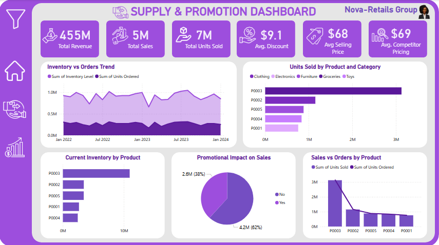
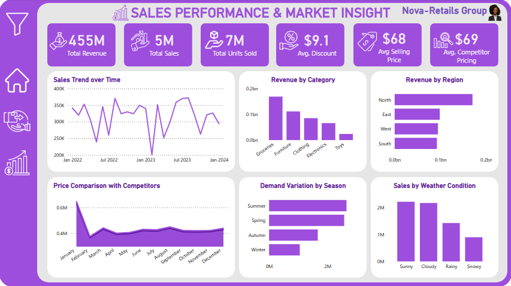

**Nova-Retails Business Intelligence Analysis**

Supply Optimization, Promotion Effectiveness & Market Performance

**Business Problem / Objective**

Nova-Retails management wants full visibility into operational efficiency and market performance across products, categories, regions, and promotions.

- The leadership team needs to understand:

- How inventory aligns with customer demand

- Whether promotions are truly driving incremental sales

- Which products and categories dominate revenue

- How pricing compares to competitors

- Which regions, seasons, and weather conditions influence demand

- Where operational inefficiencies or growth opportunities exist

This project answers the core question:

How can Nova-Retails optimize supply, pricing, and promotions to maximize revenue while minimizing inventory risk?

**Dataset Overview**

Data Source: Retail transactional and inventory dataset

Time Period Covered: January 2022 – January 2024

Business Scope: Multi-category retail operations

Metrics Tracked: Revenue, Sales Volume, Units Sold, Pricing, Discounts, Inventory Levels, Orders

**Key Columns in the Dataset**

- Order Date

- Product ID

- Category (Clothing, Electronics, Furniture, Groceries, Toys)

- Units Sold

- Units Ordered

- Inventory Level

- Revenue

- Discount %

- Selling Price

- Competitor Price

- Promotion Status (Yes/No)

- Region (North, East, West, South)

- Season

- Weather Condition

**Tools Used**

Power BI / Tableau (Dashboard Development)

Excel / Power Query (Data Cleaning & Structuring)

DAX / Calculated Fields (KPI & metric creation)

Data Modeling (Fact & Dimension relationships)

**Data Cleaning & Preparation**

- Removed duplicate transaction records

- Standardized date formats for time-series analysis

- Created derived date fields (Year, Month, Season)

- Ensured numeric consistency for revenue and pricing columns

- Created Promotion Flag (Yes/No classification)

- Validated inventory and order quantity alignment

- Structured data into Fact (Sales) and Dimension (Product, Region, Date) tables

**Data Modeling**

- Established relationships between:

- Fact Sales Table

- Product Dimension

- Region Dimension

- Date Dimension

- Promotion Dimension

**Key Measures Created**

- Total Revenue = SUM(Revenue) → $455M

- Total Sales Transactions → 5M

- Total Units Sold → 7M

- Average Discount → 9.1%

- Average Selling Price (ASP) → $68

- Average Competitor Price → $69

- Revenue Contribution % = Category Revenue ÷ Total Revenue

- Inventory Turnover Proxy = Units Sold ÷ Inventory Level

- Promotion Revenue Share

- Sales vs Orders Variance

**Key Questions & Analysis** 

- Supply & Promotion Dashboard

- Is inventory aligned with demand trends?

- Which products are overstocked or underperforming?

- Do promotions significantly increase revenue?

- Is there a gap between units ordered and units sold?

- Sales Performance & Market Insight Dashboard

- How does revenue trend over time?

- Which categories generate the highest revenue?

- Which regions are strongest or weakest?

- Are we competitively priced?

- How does seasonality and weather affect demand?

**Key Insights**

**1. Executive KPIs**

- Total Revenue reached $455M

- 5M sales transactions generated 7M units sold

- Average discount remained moderate at 9.1%

- Selling price ($68) is slightly below competitor pricing ($69), indicating competitive positioning

**2️. Inventory vs Orders Trend**

- Inventory levels fluctuated between 0.7M – 1.1M units

- Sales volume generally tracks orders but shows occasional mismatches

- Certain periods show excess inventory buildup — potential holding cost risk

Insight: Supply planning can be optimized to reduce overstock cycles.

**3️. Units Sold by Product**

- Product P0003 dominates with over 3M units sold

- P0002 and P0005 follow at significantly lower levels

- Lower-tier products show weak demand

Insight: Revenue concentration is driven by a few hero products.

**4️. Promotional Impact**

- 62% of total sales occurred without promotions

- 38% were driven by promotional campaigns

Insight: Promotions contribute meaningfully but organic demand remains strong.
Opportunity exists to test targeted promotions rather than blanket discounts.

**5️. Sales vs Orders Gap**

- P0003 shows high alignment between orders and sales

- Other products show a drop-off from ordered to sold units

Insight: Some products may be over-forecasted.

**6️. Revenue by Category**

- Groceries lead total revenue

- Furniture and Clothing follow

- Toys contribute the least

Insight: Core revenue is concentrated in essential categories.

**7️. Revenue by Region**

- North region dominates revenue performance

- South underperforms relative to others

Insight: Expansion strategies should prioritize strong-performing regions while investigating barriers in weaker markets.

**8️. Pricing Comparison**

- Prices closely mirror competitor averages

- Minor monthly fluctuations suggest reactive pricing strategy

Insight: There is room for strategic price differentiation rather than reactive matching.

**9️. Demand Variation by Season**

- Summer shows peak demand

- Winter shows the lowest

Insight: Strong seasonal patterns require dynamic inventory allocation.

**10. Sales by Weather Condition**

- Sunny and Cloudy conditions drive the highest sales

- Snowy conditions significantly reduce demand

Insight: Weather-sensitive forecasting can improve stock planning.

**Recommendations**

**Supply Chain Optimization**

- Adjust inventory planning using seasonal demand signals

- Reduce overstock in low-performing products

- Increase replenishment cycles for high-demand SKUs

**Promotion Strategy**

- Focus targeted promotions on mid-tier products

- Test margin-controlled discount bands

- Avoid over-discounting hero products

**Pricing Strategy**

- Consider premium pricing in high-demand seasons

- Implement competitor gap monitoring

**Regional Growth Strategy**

- Scale operations in North region

- Deploy targeted marketing in South

**Forecasting Improvement**

- Integrate weather and seasonal forecasting into demand planning

**Dashboard Structure**

**1️. Supply & Promotion Dashboard**

Includes:

- Total Revenue, Sales, Units Sold

- Avg Discount & Price Metrics

- Inventory vs Orders Trend

- Units Sold by Product

- Promotional Impact Pie

- Sales vs Orders Comparison

**2️. Sales Performance & Market Insight**

Includes:

- Sales Trend Over Time

- Revenue by Category

- Revenue by Region

- Price Comparison

- Demand by Season

- Sales by Weather Condition

**Conclusion**

This Nova-Retails analysis transforms raw operational data into executive-level intelligence.

The dashboards:

- Reveal revenue concentration risks

- Highlight seasonal and regional demand drivers

- Quantify promotional effectiveness

- Identify pricing positioning

- Improve inventory alignment

The result is a decision-support system that empowers leadership to optimize supply chain, marketing strategy, and pricing models for sustainable revenue growth.

**Limitations**

- Competitor pricing limited to average benchmarks

- No marketing spend data available

- Customer-level retention metrics not included

- External macroeconomic factors not captured
